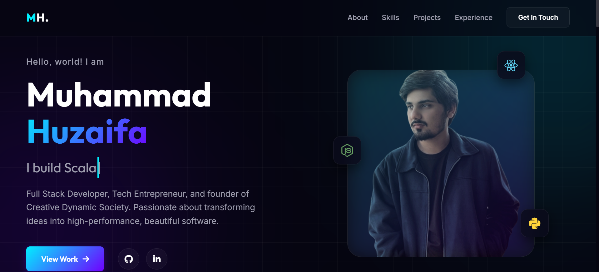
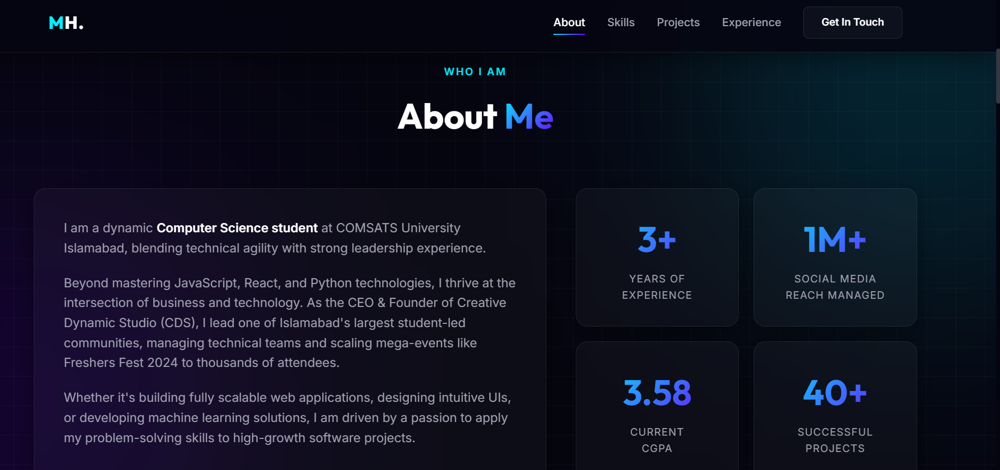
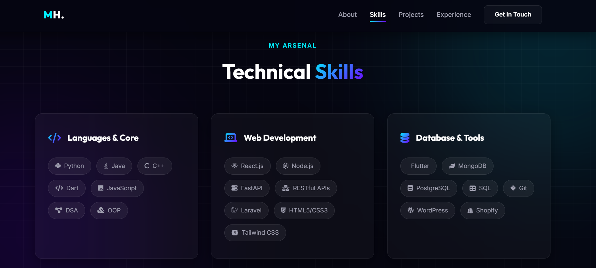
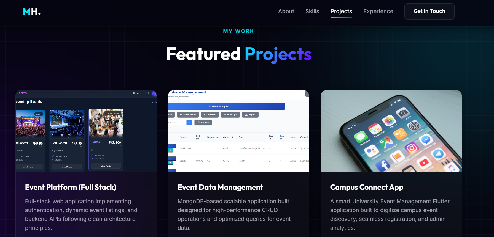
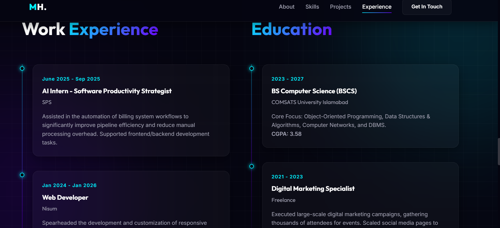
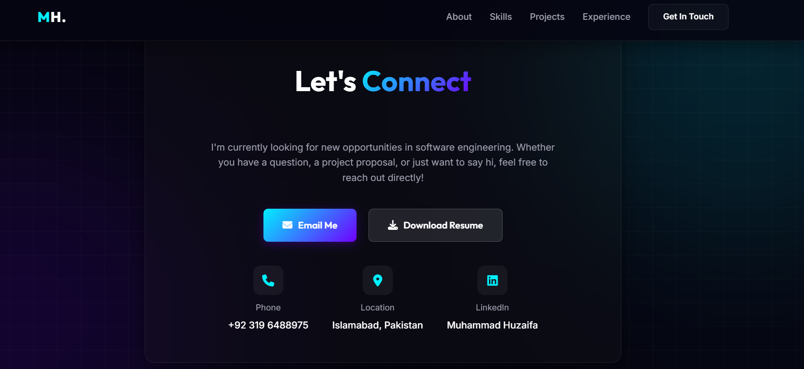

# Professional Tech Portfolio

A modern, responsive, and visually striking personal portfolio website designed for software engineers and tech professionals. Built with a focus on premium aesthetics, this portfolio features a sleek dark theme, glassmorphism UI elements, and smooth micro-animations to showcase projects, skills, and experience effectively.

## 🚀 Live Demo
[Insert Link to Live Demo Here]

## 🌟 Key Features

*   **Modern Dark Theme:** A carefully curated premium dark aesthetic with neon cyan and purple gradient accents.
*   **Glassmorphism Effects:** Frosted glass cards and UI elements using CSS `backdrop-filter` for a modern, deep look.
*   **Dynamic Interactivity:**
    *   Self-deleting typewriter effect in the hero section.
    *   Scroll-reveal animations using `IntersectionObserver` for smooth section appearances.
    *   Hover glow effects on project cards that follow the mouse cursor.
*   **Featured Projects Showcase:** Dedicated grid layout to highlight top projects with external links to GitHub repositories and tech stack tags.
*   **Responsive Timelines:** Clean, vertical timeline layouts for Experience and Education sections.
*   **Fully Responsive:** Optimized for all screen sizes, from 4K desktop monitors down to mobile devices, including a smooth mobile side-navigation menu.
*   **Direct Contact:** Replaced standard forms with direct communication channels (Email, LinkedIn, Phone) and a one-click Resume Download button.

## 🛠️ Technology Stack

This project is built purely with vanilla web technologies, ensuring maximum customizability, fast load times, and zero external framework dependencies for the core structure.

*   **HTML5:** Semantic structuring and modern markup.
*   **CSS3 (Vanilla):** Custom styling, CSS Grid/Flexbox layouts, CSS variables, keyframe animations, and glassmorphism utilities.
*   **JavaScript (Vanilla):** DOM manipulation, IntersectionObserver for scroll animations, typewriter effect logic, and mobile menu handling.
*   **FontAwesome:** Scalable vector icons for technologies, contact info, and social links.
*   **Google Fonts:** `Inter` for body text and `Outfit` for headings to provide a clean, modern typographic hierarchy.

## Screenshots








## 📂 Project Structure

```text
├── index.html       # The main HTML structure of the portfolio
├── styles.css       # All CSS styling, variables, theme definitions, and animations
├── script.js        # JavaScript logic for interactivity (typing effect, scroll reveals, etc.)
├── pic2.png         # Profile image used in the hero section
├── 2.png            # Project thumbnail placeholder
├── 3.png            # Project thumbnail placeholder
├── 6.jpeg           # Project thumbnail placeholder
└── README.md        # This documentation file
```

## 💻 How to Run Locally

Since this is a static website utilizing vanilla web technologies, running it locally is incredibly simple.

1.  **Clone the repository:**
    ```bash
    git clone https://github.com/huzaifanoon/Tech-Portfolio-Personal.git
    ```
2.  **Navigate to the directory:**
    ```bash
    cd Tech-Portfolio-Personal
    ```
3.  **Open the file:**
    Simply double-click on `index.html` to open it in your default web browser.

    Alternatively, to test it through a local server (recommended to avoid any potential CORS issues with local fonts/icons in some browsers):
    *   **Using Python 3:**
        ```bash
        python -m http.server 8000
        ```
        Then, navigate to `http://localhost:8000` in your browser.
    *   **Using VS Code:**
        Install the **"Live Server"** extension, right-click on `index.html`, and select "Open with Live Server".

## 📝 Customization

To customize this portfolio for your own use:
1.  **Content:** Edit the text within `index.html` (e.g., Hero section, About Me, Projects, Experience).
2.  **Colors:** Modify the CSS variables inside `:root` at the top of `styles.css` to change the primary and secondary accents.
3.  **Resume:** Update the `href` attribute of the "Download Resume" button in the `#contact` section of `index.html` to point to your Google Drive link or a physical PDF file.
4.  **Images:** Replace the `.png` and `.jpeg` files with your own profile picture and project screenshots. Ensure you update the `src` attributes in `index.html` accordingly.

## 📬 Contact

**Muhammad Huzaifa**
*   Email: huzaifanoon21@gmail.com
*   LinkedIn: [https://www.linkedin.com/in/muhammad-huzaifa-811772275/](https://www.linkedin.com/in/huzaifanoon/)
*   GitHub: [https://github.com/huzaifanoon](https://github.com/huzaifanoon)

---
*Built with precision and passion.*
